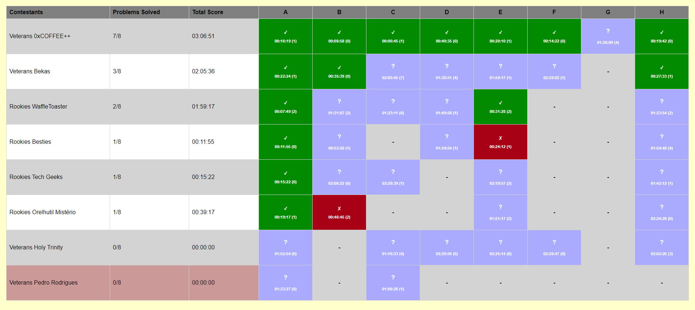

# MooshakResolver
This is a very simple version of ICPC Resolver for Mooshak contests

# How to use
After your contest is over, download your contest's zip from Mooshak, and save the Content.xml in the "contest" Folder.

After this, you only need to run a webserver with the current files.

In order to reveal the submissions, you should use the SPACE key.

# Preview

